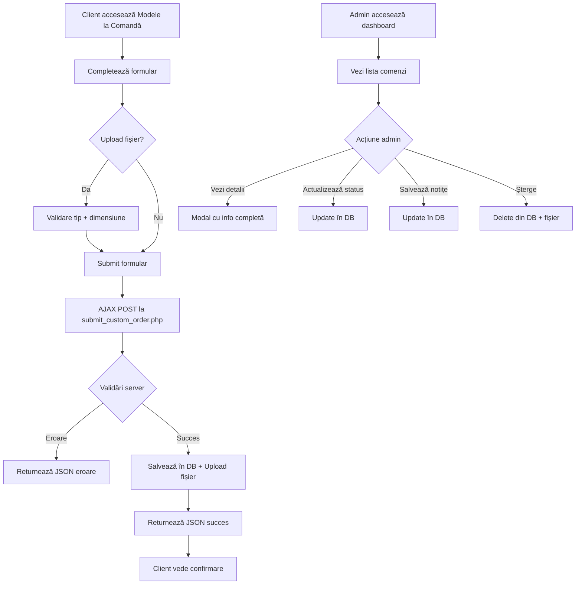

# 📋 Sistem Modele la Comandă - Documentație Completă

## 📖 Prezentare Generală

Sistemul **"Modele la Comandă"** permite clienților să trimită cereri personalizate pentru designuri de broderie custom, cu posibilitatea de upload fișiere (imagini, arhive). Administratorii pot gestiona aceste cereri dintr-un dashboard dedicat.

---

## 🗂️ Structură Fișiere

```
Brodero/
├── database_custom_orders.sql          # Migrare bază de date
├── pages/modele-la-comanda.php         # Formular public
├── ajax/submit_custom_order.php        # Handler procesare formular
├── ajax/get_custom_order.php           # API pentru detalii comandă (admin)
├── admin/admin_custom_orders.php       # Dashboard administrare
├── uploads/custom-orders/              # Director upload-uri
│   └── .htaccess                       # Protecție securitate
└── CUSTOM_ORDERS_COMPLETE.md           # Această documentație
```

---

## 🚀 Instalare Pas cu Pas

### 1️⃣ Import Bază de Date

```bash
# Rulează migrarea SQL
mysql -u username -p database_name < database_custom_orders.sql
```

**SAU** prin phpMyAdmin:
1. Deschide phpMyAdmin → Selectează baza de date
2. Import → Alege fișierul `database_custom_orders.sql`
3. Execută

**Structura tabelului creat:**
```sql
CREATE TABLE custom_orders (
    id INT AUTO_INCREMENT PRIMARY KEY,
    name VARCHAR(255) NOT NULL,
    email VARCHAR(255) NOT NULL,
    phone VARCHAR(50),
    description TEXT NOT NULL,
    budget VARCHAR(100),
    file_path VARCHAR(500),
    file_original_name VARCHAR(255),
    status ENUM('new', 'in_progress', 'completed', 'cancelled') DEFAULT 'new',
    admin_notes TEXT,
    ip_address VARCHAR(45),
    created_at TIMESTAMP DEFAULT CURRENT_TIMESTAMP,
    updated_at TIMESTAMP DEFAULT CURRENT_TIMESTAMP ON UPDATE CURRENT_TIMESTAMP
);
```

### 2️⃣ Configurare Directoare

```bash
# Creează director pentru upload-uri (dacă nu există)
mkdir -p uploads/custom-orders

# Setează permisiuni pentru scriere
chmod 755 uploads/custom-orders

# Verifică că .htaccess există în uploads/custom-orders/
# Fișierul este deja creat automat
```

**⚠️ IMPORTANT:** Verifică că fișierul `.htaccess` din `uploads/custom-orders/` conține:
```apache
Options -Indexes
<FilesMatch "\.(php|php3|php4|php5|phtml|exe|sh|cgi|pl)$">
    Order Allow,Deny
    Deny from all
</FilesMatch>
```

### 3️⃣ Adaugă SEO pentru Pagină

```bash
# Rulează update-ul SEO (deja inclus în database_seo_pages.sql)
# SAU adaugă manual:
INSERT INTO seo_pages (page_slug, title, description, keywords) VALUES
('modele-la-comanda', 
 'Modele la Comandă - Design Personalizat Brodero', 
 'Comandă designuri unice de broderie personalizată. Trimite-ne ideile tale și vei primi un model unic creat special pentru tine.', 
 'modele la comandă, design personalizat, comenzi custom, broderie personalizată, design unic');
```

### 4️⃣ Verificare Instalare

✅ **Checklist instalare:**
- [ ] Tabelul `custom_orders` există în baza de date
- [ ] Directorul `uploads/custom-orders/` are permisiuni 755
- [ ] Fișierul `.htaccess` există în `uploads/custom-orders/`
- [ ] Pagina `/pages/modele-la-comanda.php` se încarcă fără erori
- [ ] Link-ul "Modele la Comandă" apare în header-ul site-ului
- [ ] Dashboard-ul admin `/admin/admin_custom_orders.php` este accesibil

---

## 👥 Ghid Utilizare Client

### Accesare Formular
1. Click pe **"Modele la Comandă"** din meniul principal
2. SAU accesează direct: `https://tusite.ro/pages/modele-la-comanda.php`

### Completare Formular

**📝 Câmpuri obligatorii:**
- **Nume și Prenume:** Nume complet
- **Email:** Adresă de contact validă
- **Telefon:** Număr de telefon (opțional)
- **Descriere proiect:** Detalii cerințe (max 5000 caractere)
- **Budget orientativ:** Suma estimată (ex: "100-200 RON")

**📎 Upload Fișiere:**
- **Tipuri acceptate:** JPG, PNG, PDF, ZIP, RAR
- **Dimensiune maximă:** 10 MB per fișier
- **Exemple fișiere:** Schiță desenată, logo-uri, imagini inspirație, arhive cu multiple fișiere

### Validări Formular

🔴 **Erori comune:**
- Email invalid → Verifică formatul (ex: `nume@domeniu.ro`)
- Fișier prea mare → Comprimă imaginea sau folosește ZIP
- Format fișier interzis → Convertește la JPG/PNG/PDF
- Descriere prea scurtă → Minim 20 caractere necesare

✅ **Succes:** După trimitere, vei primi confirmare pe ecran și email de notificare.

---

## 🎛️ Ghid Administrare

### Accesare Dashboard Admin

```
URL: /admin/admin_custom_orders.php
Acces: Doar utilizatori autentificați ca admin
```

### Statistici Dashboard

**📊 Carduri de statistici:**
- **Total Cereri:** Număr total comenzi primite
- **Noi:** Comenzi neproesate (status: `new`)
- **În Lucru:** Comenzi active (status: `in_progress`)
- **Finalizate:** Comenzi completate (status: `completed`)

### Gestionare Comenzi

#### 1️⃣ Vizualizare Detalii
- Click pe butonul **"Vezi Detalii"** (👁️ albastru)
- Modal cu toate informațiile comenzii:
  - Date client (nume, email, telefon)
  - Descriere proiect completă
  - Budget orientativ
  - Fișier atașat (dacă există)
  - Data trimiterii
  - IP client

#### 2️⃣ Descărcare Fișiere
- Din modal: Click pe **"📥 Descarcă Fișierul"**
- Fișierul va fi descărcat cu numele original trimis de client

#### 3️⃣ Actualizare Status

**Status-uri disponibile:**
- 🆕 **Nou** (`new`) - Comandă abia primită
- ⚙️ **În Lucru** (`in_progress`) - În curs de procesare
- ✅ **Finalizat** (`completed`) - Comandă completată
- ❌ **Anulat** (`cancelled`) - Comandă respinsă/anulată

**Cum să actualizezi:**
1. Selectează status din dropdown
2. Click **"Actualizează Status"**
3. Pagina se reîmprospătează automat

#### 4️⃣ Adăugare Notițe Admin

**Folosire:**
- Scrie notițe interne în textarea "Notițe Administrator"
- Click **"Salvează Notițe"**
- Notițele NU sunt vizibile clienților (doar pentru admin)

**Exemple notițe:**
```
"Discutat telefonic - clientul dorește model floral"
"Trimis draft 1 pe email - așteaptă feedback"
"Finalizat - livrare prin email pe 15.01.2025"
```

#### 5️⃣ Ștergere Comandă

⚠️ **ATENȚIE:** Ștergerea este PERMANENTĂ!

1. Click pe butonul **"🗑️ Șterge"** (roșu)
2. Confirmă ștergerea în dialogul de alertă
3. Fișierul atașat va fi șters automat de pe server

---

## 🔒 Securitate

### Protecție Upload Fișiere

**✅ Măsuri implementate:**
1. **Validare extensii:** Doar JPG, PNG, PDF, ZIP, RAR
2. **Validare MIME type:** Verificare reală tip fișier (nu doar extensie)
3. **Limită dimensiune:** Maximum 10 MB per fișier
4. **Renumire unică:** Fișiere stocate cu nume generat aleatoriu (previne suprascrierea)
5. **Blocare execuție:** `.htaccess` blochează rularea PHP în directorul uploads
6. **Blocaj listare:** Directorul nu poate fi listat în browser

### Protecție Formular

**🛡️ Anti-Spam:**
- **Honeypot field:** Câmp invizibil pentru detectare bots
- **CSRF Token:** Validare token pentru prevenirea atacurilor CSRF
- **Rate limiting:** Validare IP pentru prevenirea spam-ului

**🔐 Validare Input:**
- Sanitizare email cu `filter_var()`
- Escape HTML în descrieri cu `htmlspecialchars()`
- Prepared statements PDO pentru prevenirea SQL injection

### Permisiuni Recomandate

```bash
# Directoare
chmod 755 uploads/
chmod 755 uploads/custom-orders/

# Fișiere uploaded (automat la upload)
chmod 644 uploads/custom-orders/*.jpg
```

---

## 🧪 Testare Sistem

### Test 1: Upload Fișier Valid

**Pași:**
1. Acesează `/pages/modele-la-comanda.php`
2. Completează toate câmpurile
3. Atașează o imagine JPG de 2 MB
4. Trimite formularul

**Rezultat așteptat:**
- ✅ Mesaj succes: "Comanda ta a fost trimisă cu succes!"
- ✅ Înregistrare nouă în tabelul `custom_orders`
- ✅ Fișier salvat în `uploads/custom-orders/`

### Test 2: Upload Fișier Invalid

**Pași:**
1. Încearcă să uploadezi un fișier `.exe` sau `.php`

**Rezultat așteptat:**
- ❌ Eroare: "Tip de fișier nepermis"
- ❌ Fișierul nu este salvat

### Test 3: Limită Dimensiune

**Pași:**
1. Încearcă să uploadezi un fișier de 15 MB

**Rezultat așteptat:**
- ❌ Eroare JavaScript înainte de submit: "Fișierul depășește limita de 10 MB"

### Test 4: Dashboard Admin

**Pași:**
1. Autentifică-te ca admin
2. Accesează `/admin/admin_custom_orders.php`
3. Click pe "Vezi Detalii" pentru o comandă
4. Actualizează status la "În Lucru"

**Rezultat așteptat:**
- ✅ Modal se deschide cu datele complete
- ✅ Status se actualizează instant
- ✅ Pagina se reîmprospătează

### Test 5: Protecție .htaccess

**Pași:**
1. Încearcă să accesezi direct: `https://tusite.ro/uploads/custom-orders/`

**Rezultat așteptat:**
- ❌ Eroare 403 Forbidden (listarea este blocată)

**Pași 2:**
1. Uploadează un fișier test `.php` prin formular (va fi respins)
2. Manual creează un fișier `test.php` în `uploads/custom-orders/`
3. Încearcă să-l accesezi: `https://tusite.ro/uploads/custom-orders/test.php`

**Rezultat așteptat:**
- ❌ Eroare 403 Forbidden (execuția PHP este blocată)

---

## 📊 Fluxul de Lucru Complet



---

## 🔧 Troubleshooting

### Problema: "Fișierul nu a putut fi uploadat"

**Cauze posibile:**
1. Directorul `uploads/custom-orders/` nu există
   - **Soluție:** `mkdir uploads/custom-orders && chmod 755 uploads/custom-orders`

2. Permisiuni insuficiente
   - **Soluție:** `chmod 755 uploads/custom-orders`

3. Limită PHP `upload_max_filesize`
   - **Verificare:** `php -i | grep upload_max_filesize`
   - **Soluție:** Editează `php.ini`: `upload_max_filesize = 10M`

### Problema: "Eroare bază de date"

**Cauze posibile:**
1. Tabelul `custom_orders` nu există
   - **Soluție:** Rulează `database_custom_orders.sql`

2. Conexiune DB eșuată
   - **Verificare:** Verifică `config/database.php`

### Problema: ".htaccess nu funcționează"

**Cauze posibile:**
1. Apache `AllowOverride` dezactivat
   - **Soluție (cPanel/Hostinger):** De obicei activat implicit
   - **Soluție (server propriu):** Editează `httpd.conf`:
     ```apache
     <Directory "/path/to/brodero">
         AllowOverride All
     </Directory>
     ```

2. Module Apache lipsă
   - **Verificare:** `apache2ctl -M | grep rewrite`
   - **Soluție:** `sudo a2enmod rewrite`

### Problema: "Dashboard nu se încarcă"

**Cauze posibile:**
1. Nu ești autentificat ca admin
   - **Soluție:** Login la `/admin/login.php`

2. Sesiune expirată
   - **Soluție:** Re-login

---

## 📈 Extensii Viitoare (Opțional)

### Idei de dezvoltare:

1. **Notificări Email:**
   - Trimite email automat la client când status devine "completed"
   - Notificare admin la fiecare comandă nouă

2. **Upload Multiple Fișiere:**
   - Permite atașarea a până la 5 fișiere per comandă

3. **Galerie Portofoliu:**
   - Secțiune "Exemple Modele la Comandă" cu lucrări anterioare

4. **Sistem Rating:**
   - Clienții pot evalua experiența după finalizare

5. **Istoric Conversație:**
   - Chat integrat între admin și client pentru clarificări

6. **Export Comenzi:**
   - Export CSV/Excel pentru raportare

---

## 📞 Contact Support

Pentru probleme tehnice sau întrebări:
- **GitHub Issues:** [repo-url]/issues
- **Email tehnic:** support@brodero.ro

---

## 📝 Changelog

### v1.0.0 (Ianuarie 2025)
- ✅ Implementare sistem complet "Modele la Comandă"
- ✅ Formular public cu upload fișiere
- ✅ Dashboard admin cu filtrare și statistici
- ✅ Securitate avansată (CSRF, validare MIME, .htaccess)
- ✅ Integrare SEO și sitemap
- ✅ Documentație completă

---

**🎉 Sistem gata de producție!**
